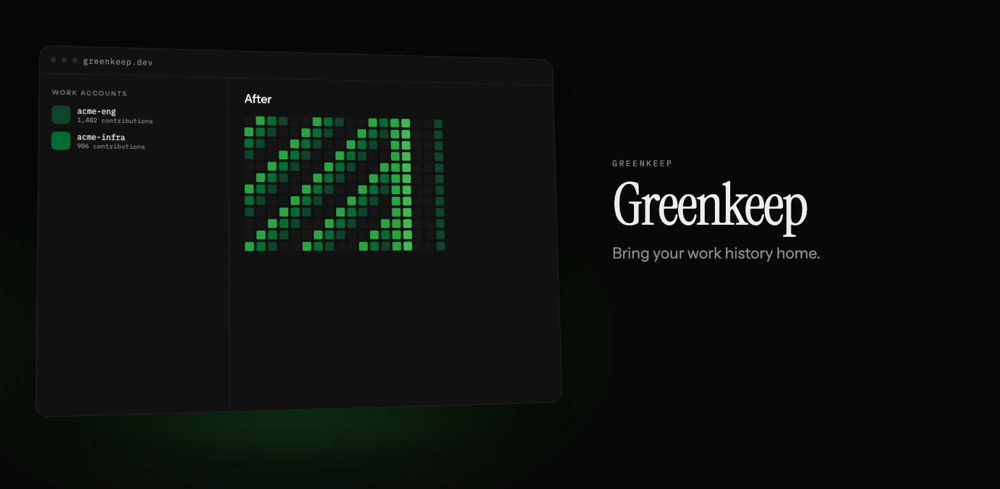
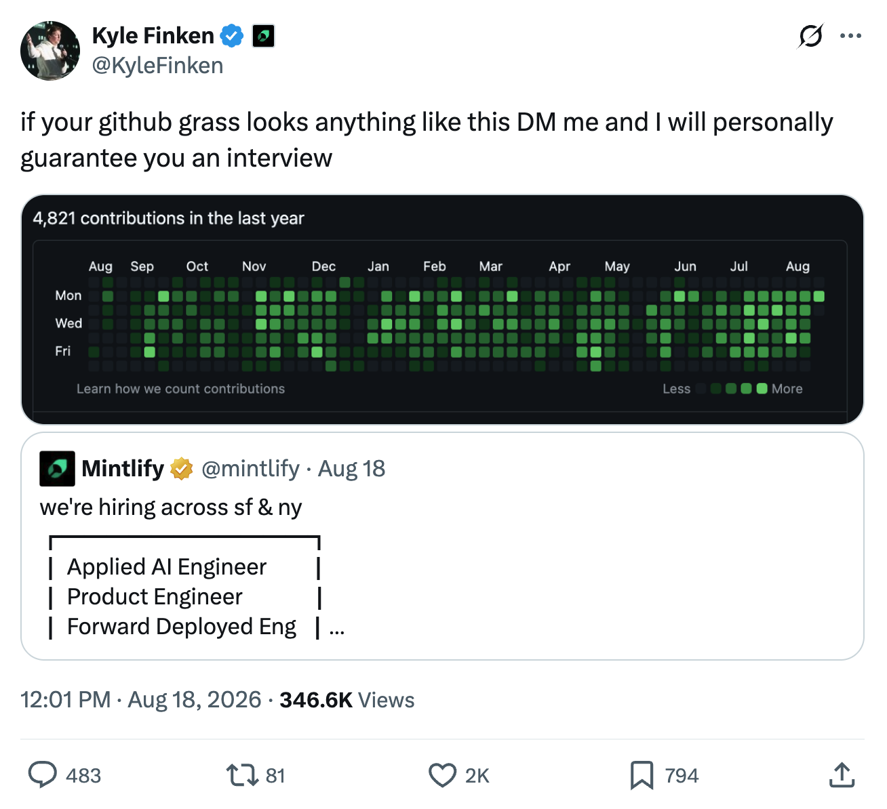

# Greenkeep 🌱

Your work GitHub's grass, on your personal profile.

Greenkeep copies your work accounts' commit histories onto your personal account using private, backdated commits. The commit counts come over. Your code stays at work.

## It is a vanity metric. But employers still care.

Whichever way you feel about it – hiring managers are taking note. When your real work happens within a company org or enterprise, your personal profile looks empty even though you're shipping. Greenkeep fixes that.

## Three steps and your graph is yours to keep

1. **Connect.** Login with GitHub to your personal account, and point Greenkeep at your work usernames. **Nothing gets written to work repos.**
2. **Preview.** See the merged result before anything gets written. Pick the date range and how dark the squares get if you prefer.
3. **Keep.** Sync once, or subscribe so your work gets copied over forever without lifting a finger.

## Private by design

Greenkeep writes empty commits into a private repo always on your personal account by default. No code leaves work, and we never read a single line.

## Plans

- **One-week access.** Pay once. Take a week to copy over whatever you need. Useful if you're about to leave a company.
- **Monthly.** Sync every day, automatically. Don't worry about forgetting before you leave.
